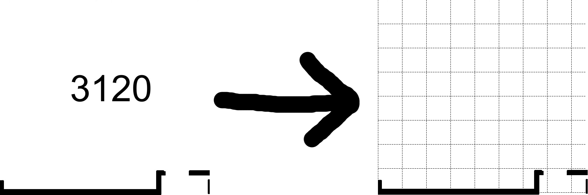
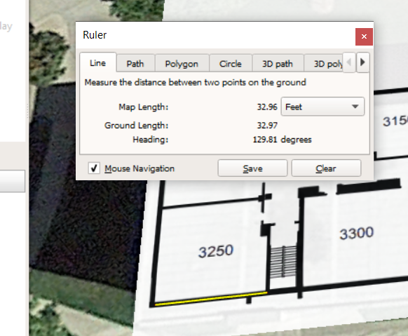
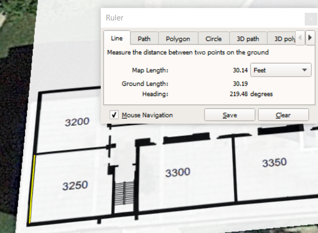

# ACMHackathon2020

This is a repository showcasing the demo code to automate the grid drawing process used after collecting key data from analyzing satellite imagery



## Key input

To use any of the functions in the repository you'd need to first measure the floor plan. Since this one of the most important parts of the process (We will use the first couple measurements to extrapolate information about the whole floor). 

We recommend using as many data points as possible. Even with two data (the amount used in the demo), it was still very accurate. Currently, the code is setup for the Colden Hall 3rd floor measurements we took below.

After taking measurements of walls, find how many pixels each wall is. Finding out how many each feet relates to each wall is a crucial part of this process.

Lastly, calculate the inches per pixel constant measurement using the equation by dividing inches by the amount of corresponding pixels (then taking average if more than one data points).





## Usage
Make sure to have python 3 installed (haven't tested with python2, it not may work), and follow installation instructions for [pytesseract](https://github.com/madmaze/pytesseract) beforehand.

```bash
python -m pip install --upgrade pip
python -m pip install pytesseract Pillow numpy
```

### Function usage

There are three main functions that can be used (check [main.py](main.py) for an actual example):

```python
# Dotify -> Returns grid dotted image by a specific interval measured by inches per 
from PIL import Image
from dots import dotify

im = Image.open('path/to/image.png')
im_grid = dotify(im, inches_per_pixel, dist=dist_in_inches)
im_grid.show()

# removenums -> Returns the same image given to it but without the text. Uses pytesseract to preform OCR and it colors it with any color specified (Used to remove room numbers in the middle of rooms on floor plan)
from removenums import removenums

im_plain = removenums(im)
im_plain.show()

# setup_gui -> Opens a tinker gui. To use the gui you'd need to scroll to a classroom, click on the top left corner, then bottom right. After that a box will pop up asking for classroom number. Put whatever makes sense (i.e. CH3120) and click save. The image will be saved in the directory given removing the classrooms and adds the grid to it.
from gui import setup_gui

# Before using setup_gui make sure your display settings at not zoomed in, in other words make sure you scale/layout of computer screen is set to 100%.
setup_gui(inches_per_pixel, 'path/to/floor_image.png', 'path/to/output_directory')
```
